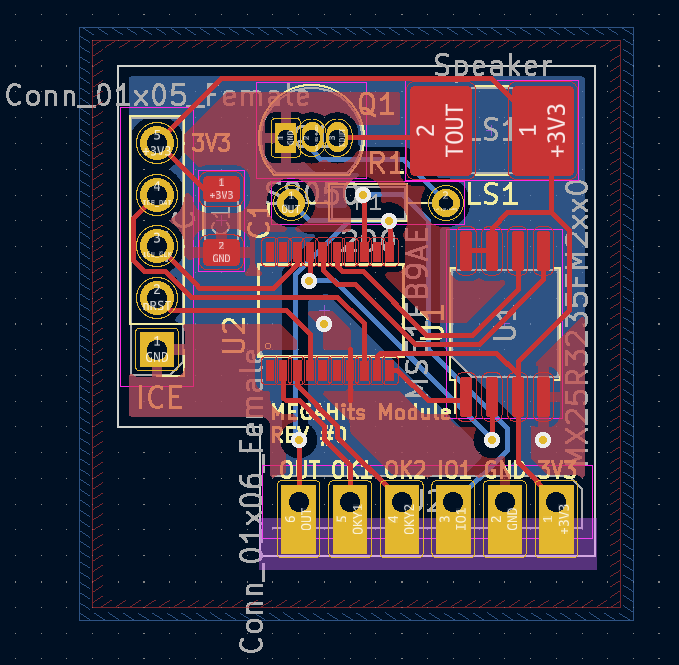

# MegaHits Module V1
MegaHits playback module version 1 is based on the **MS51FB9AE** 1T 8051 microcontroller.

## Why 8051?
We tested multiple platforms including AVR, MS51, RP2040, STM32F0, and MSP430. So far STM32 and MS51 sounded the best. However, due to the high lead times(5 years for some STM32 parts!), we selected MS51FB9AE 1T 8051 MCU from Nuvoton technologies. It's widely available, relatively fast, easy to develop, has tons of peripherals, and surprisingly cheap in this silicon shortage. Not only it is a sub 0.5 USD part, but also the manufacturer is giving out a discount when you purchase in small quantities.

